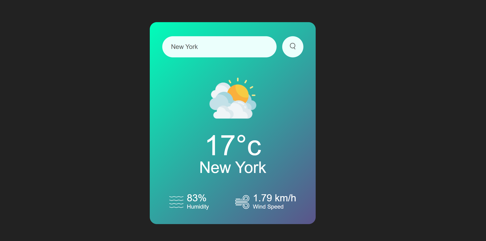

# 🌤️ Weather App

A sleek, responsive **Weather App** built using **HTML**, **CSS**, and **JavaScript**. Users can enter a city name to get real-time weather data such as temperature, humidity, and wind speed using the **OpenWeatherMap API**.

---

## 📸 Preview



---

## 🚀 Features

- 🌆 Get current weather by **city name**
- 🌡️ Displays **temperature**, **humidity**, and **wind speed**
- 🎯 Weather icons update dynamically based on conditions
- ⚠️ Handles invalid city inputs with a friendly error message
- 📱 Fully **responsive design**

---

## 🧰 Tech Stack

- **HTML5** – Structure
- **CSS3** – Styling and layout
- **JavaScript** – Fetch API, DOM manipulation
- **OpenWeatherMap API** – Weather data

---

## 📁 File Structure

```

/weather-app
│
├── index.html # HTML structure
├── style.css # CSS styling
├── script.js # JavaScript logic
├── favicon.jpg # Favicon icon
└── images/ # Image assets for UI
├── clear.png
├── clouds.png
├── drizzle.png
├── mist.png
├── rain.png
├── snow.png
├── humidity.png
├── wind.png
└── search.png


```

## 🔧 Setup Instructions

1. **Clone or download** this repository:

   ```bash
   git clone https://github.com/your-username/weather-app.git
